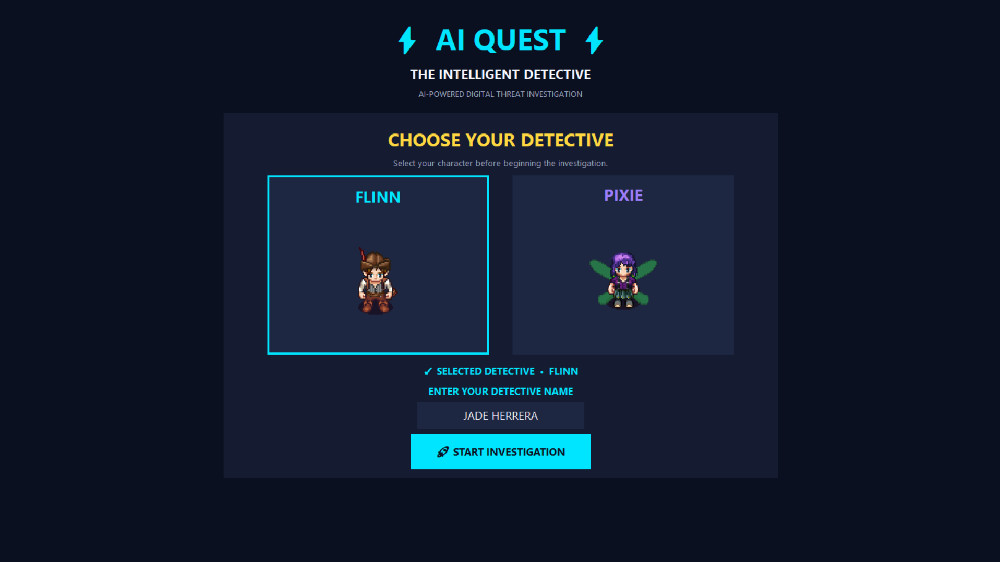
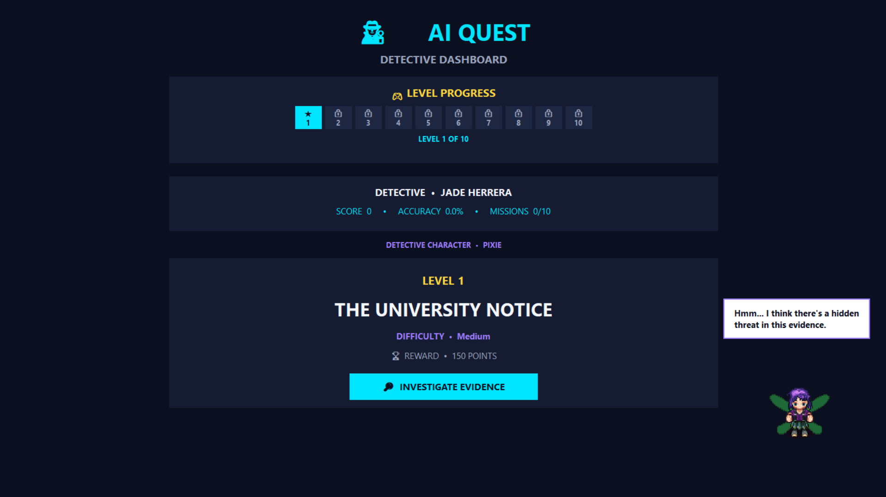
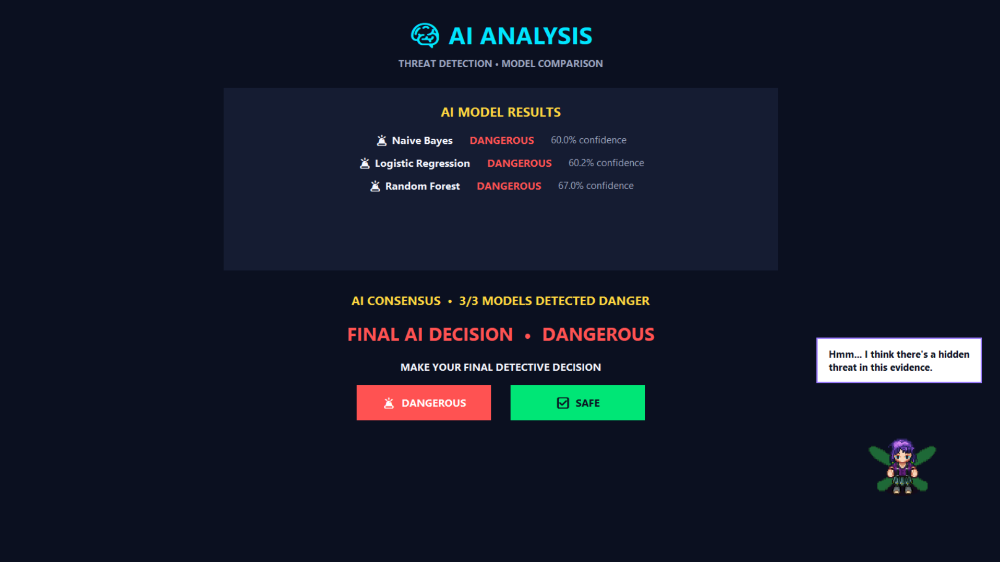
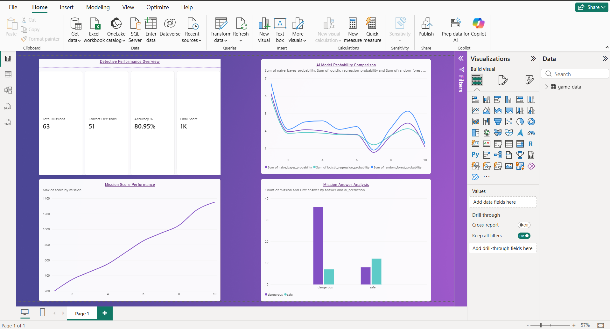
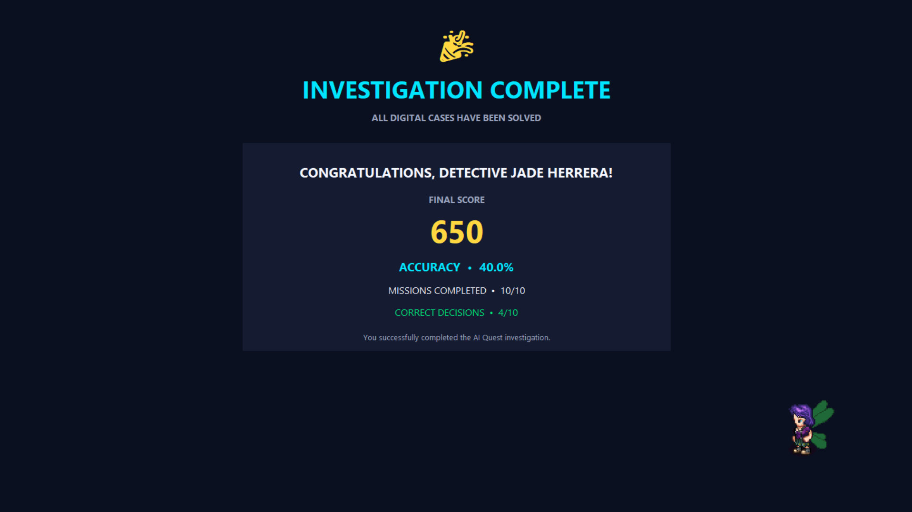
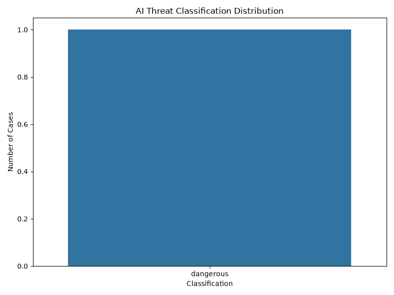

# 🕵️ AI QUEST — Intelligent Detective Game

<p align="center">
  
</p>

<p align="center">
  <strong>An AI-powered interactive detective game combining mystery solving, machine learning, data analysis, and visualization.</strong>
</p>

<p align="center">
  
  
  
  
  
</p>

---

## 🎮 About the Project

**AI QUEST — Intelligent Detective Game** is a major project that combines an interactive detective experience with **Artificial Intelligence, Machine Learning, data analysis, and visualization**.

The player takes on the role of a detective and progresses through investigations by examining clues, interacting with characters, analyzing evidence, and making decisions.

The project transforms machine-learning concepts into an interactive application where the player can experience AI-assisted investigation rather than simply viewing model outputs in a conventional interface.

---

## 🕵️ The Concept

The core idea is to combine:

**Detective Gameplay + Artificial Intelligence + Machine Learning + Data Analytics**

The player investigates a case while the underlying AI system analyzes the available evidence.

```text
                    🕵️ DETECTIVE
                         │
                         ▼
                 🔎 CASE / EVIDENCE
                         │
                         ▼
                📝 TEXT PROCESSING
                         │
                         ▼
                    TF-IDF
                         │
            ┌────────────┼────────────┐
            ▼            ▼            ▼
      Naive Bayes   Logistic      Random Forest
                    Regression
            │            │            │
            └────────────┼────────────┘
                         ▼
                  🤖 AI ANALYSIS
                         │
                         ▼
                  AI CONSENSUS
                         │
                         ▼
               🧩 PLAYER DECISION
                         │
                         ▼
                📊 SCORE & ACCURACY
✨ Key Features
🎮 Interactive Detective Gameplay
Case-based investigation
Mystery-solving mechanics
Evidence and clue examination
Detective decision making
Mission-based progression
🤖 Artificial Intelligence
AI-assisted evidence analysis
Threat classification
Text-based machine learning
Multiple classification models
Model prediction and confidence information
AI consensus mechanism
🎭 Character System
Character selection
Custom detective characters
Character-based storytelling
Interactive character elements
Dialogue and contextual feedback
📊 Analytics
Model accuracy analysis
Performance visualization
Threat distribution analysis
Game/player performance information
Power BI analytics
🖥️ Desktop Application
Graphical user interface
Windows desktop support
Packaged executable using PyInstaller
Custom application icon and visual assets
🤖 Artificial Intelligence & Machine Learning

The project uses a text-based machine-learning pipeline for intelligent analysis of investigative evidence.

1. TF-IDF

TF-IDF (Term Frequency–Inverse Document Frequency) is used to convert textual evidence into numerical features that can be processed by machine-learning algorithms.

This allows the system to work with textual investigation data rather than requiring manually created numerical inputs.

2. Naive Bayes

Naive Bayes is used as one of the classification models for analyzing evidence and predicting the corresponding threat category.

Its probabilistic approach provides one independent perspective on the investigation.

3. Logistic Regression

Logistic Regression is another classification model used to analyze the extracted text features and estimate the corresponding class.

The model provides an additional prediction that can be compared with the other classifiers.

4. Random Forest

Random Forest is an ensemble machine-learning algorithm based on multiple decision trees.

It provides another independent classification result and adds diversity to the project's multi-model analysis.

5. AI Consensus

Instead of depending on a single classifier, AI QUEST brings together the outputs of:

Naive Bayes
Logistic Regression
Random Forest

The individual model predictions can then be compared to produce an overall AI-assisted interpretation of the evidence.

This creates a simple multi-model consensus approach for the investigation.

🧩 How the Game Works
Step 1 — Select Your Character

The player begins by selecting a detective character.

The available character system gives the investigation a more game-oriented experience.

Step 2 — Enter the Investigation

The player enters the main investigation interface where the current case, mission information, score, accuracy, difficulty, and other game information are displayed.

Step 3 — Examine the Evidence

The player investigates the information associated with the case.

Clues and evidence form the basis for the detective's final decision.

Step 4 — AI Analysis

The evidence is processed using the project's machine-learning pipeline.

The text is transformed using TF-IDF and analyzed using:

Naive Bayes
     +
Logistic Regression
     +
Random Forest
     ↓
AI Analysis
Step 5 — Make the Detective Decision

After examining the evidence and AI analysis, the player makes the final investigation decision.

The game allows the player to compare their reasoning with the AI-assisted analysis.

Step 6 — Track Performance

The application keeps track of important gameplay information such as:

Score
Accuracy
Mission progress
Correct decisions
Investigation performance

This makes the game both interactive and measurable.

🎭 Characters

AI QUEST uses custom visual characters to create a more immersive detective environment.

The character system supports:

Detective selection
Character-based interaction
Visual storytelling
Investigation feedback
Game atmosphere
Featured Characters
Character	Role
🕵️ Flinn	Detective character
🕵️ Pixie	Detective character / investigation companion
🖼️ Project Showcase
🎭 Character Selection

The game begins with the character-selection interface.

<p align="center">  </p>
🕵️ Gameplay Dashboard

The main dashboard provides the detective with information about the current investigation and player progress.

<p align="center">  </p>
🤖 AI Analysis

The AI analysis interface presents the machine-learning results used during the investigation.

<p align="center">  </p>
📈 Model Accuracy

The project includes visualization of model accuracy for evaluating the machine-learning component.

<p align="center">  </p>
📊 Model Performance

Performance visualization provides another way to compare and understand the behavior of the machine-learning models.

<p align="center">  </p>
🚨 Threat Distribution

Threat-distribution visualization provides an overview of the categories represented within the project data.

<p align="center">  </p>
🛠️ Technology Stack
Category	Technology
💻 Programming Language	Python
🖥️ GUI Framework	Tkinter
🤖 Machine Learning	Scikit-learn
📝 Text Feature Extraction	TF-IDF
📊 Data Processing	Pandas
🔢 Numerical Computing	NumPy
📈 Visualization	Matplotlib
🎨 Image Processing	Pillow
🗄️ Database	SQLite
📊 Business Analytics	Microsoft Power BI
📦 Application Packaging	PyInstaller
🔧 Version Control	Git
🌐 Repository Hosting	GitHub
🖥️ Target Platform	Windows
🧠 Machine Learning Pipeline

The AI component follows a text-classification workflow:

1. Input

Investigation evidence is provided as textual information.

2. Preprocessing

The text is prepared for machine-learning analysis.

3. Feature Extraction

TF-IDF converts the text into numerical feature vectors.

4. Classification

The feature representation is passed through three classifiers:

Naive Bayes
Logistic Regression
Random Forest
5. Prediction

Each model produces its own classification result.

6. Comparison / Consensus

The outputs are presented together to support an overall AI-assisted investigation decision.

📊 Data Analytics

Machine learning is supported by a separate data-analysis and visualization layer.

The project includes visual representations for:

Model accuracy
Model performance
Threat distribution
AI analysis
Investigation performance

The project also includes Power BI resources for analytics and dashboard-oriented data exploration.

📁 Project Structure
AI-Quest-Intelligent-Detective-Game/
│
├── app/
│   └── Main game application and logic
│
├── assets/
│   └── Game graphics and visual assets
│
├── datasets/
│   └── Game and machine-learning datasets
│
├── docs/
│   └── Project documentation
│
├── models/
│   └── Machine-learning model resources
│
├── notebooks/
│   └── Experiments and analysis
│
├── powerbi/
│   └── Power BI analytics resources
│
├── screenshots/
│   ├── accuracy_chart.png
│   ├── ai_analysis.png
│   ├── character_selection.png
│   ├── gameplay_dashboard.png
│   ├── performance_chart.png
│   └── threat_distribution.png
│
├── tests/
│   └── Testing resources
│
├── .gitignore
├── requirements.txt
└── README.md
🚀 Getting Started
Prerequisites

Before running the project, make sure you have:

Windows
Python 3.x
Git
Clone the Repository
git clone https://github.com/mistmob/AI-Quest-Intelligent-Detective-Game.git

Navigate into the project:
cd AI-Quest-Intelligent-Detective-Game
Create a Virtual Environment
python -m venv .venv

Activate it:

.venv\Scripts\activate
Install Dependencies
pip install -r requirements.txt
▶️ Run the Application

Navigate to the application directory:

cd app

Then run the project's main Python application file.

The exact entry-point filename can be checked inside the app directory.

📦 Application Packaging

The project is also packaged as a Windows executable using PyInstaller.

This allows the application to be distributed as a desktop application without requiring the user to manually run the Python source code.

The packaged application includes the project's custom application icon and required runtime resources.

🌟 Advantages
🎓 1. Educational Value

AI QUEST provides an interactive way to understand machine-learning concepts through gameplay.

Instead of learning only from model code or theoretical examples, users can see AI analysis integrated into an application.

🤖 2. Practical AI Implementation

The project demonstrates how machine-learning models can be incorporated into a real application workflow.

🧠 3. Multi-Model Analysis

Using Naive Bayes, Logistic Regression, and Random Forest allows multiple classifiers to analyze the same evidence.

This provides a broader perspective than relying on a single model.

🎮 4. Engaging User Experience

The detective-game format combines:

Storytelling
Investigation
Character interaction
Decision making
Scoring
AI analysis

This makes the project more engaging than a traditional machine-learning demonstration.

📊 5. Data-Driven Insights

The project includes charts and Power BI resources for examining model and investigation-related data.

🧩 6. Integration of Multiple Technologies

AI QUEST brings together several areas of computer science:

Python
  +
GUI Development
  +
Machine Learning
  +
Text Processing
  +
Data Analysis
  +
Visualization
  +
Database
  +
Game Design
  +
Version Control
🛠️ 7. Modular Organization

The repository separates application code, datasets, models, notebooks, analytics, screenshots, tests, and documentation.

This makes the project easier to maintain and extend.

🔮 Future Scope

The project can be expanded with:

More investigation cases
Larger datasets
Additional machine-learning algorithms
Improved model training and tuning
More sophisticated evidence analysis
Adaptive difficulty
Expanded character interaction
More advanced dialogue systems
Audio effects and animations
Additional Power BI dashboards
Enhanced game progression
Cross-platform support
📚 Resources & Credits
Technologies
Python — Application development
Tkinter — Graphical user interface
Scikit-learn — Machine learning
Pandas / NumPy — Data processing
Matplotlib — Data visualization
Pillow — Image handling
SQLite — Database
Power BI — Analytics and dashboards
PyInstaller — Windows application packaging
Git / GitHub — Version control and project hosting
Character & Visual Resources
Custom-created project graphics
Custom detective character assets
Referenced visual resources used for character creation
📌 Project Highlights
Area	Implementation
🎮 Game	Interactive detective investigation
🤖 AI	Multi-model threat analysis
🧠 ML Models	Naive Bayes, Logistic Regression, Random Forest
📝 NLP	TF-IDF
🎭 Characters	Custom detective characters
📊 Analytics	Charts + Power BI
🗄️ Database	SQLite
🖥️ GUI	Tkinter
📦 Deployment	PyInstaller executable
🔧 Version Control	Git + GitHub
👩‍💻 Author
Nandini Goyal

Computer Science & Engineering Student

Major Project

AI QUEST — Intelligent Detective Game

A project combining:

Artificial Intelligence • Machine Learning • Game Development • Data Analytics • Visualization

📜 Project Status

🟢 Major Project — Developed

The repository contains the application, supporting project resources, machine-learning components, analytics resources, screenshots, documentation, and testing structure.

<p align="center">
🕵️ Investigate.
🤖 Analyze.
🧩 Decide.
🏆 Solve the Case.
</p> <p align="center"> <strong>AI QUEST — Where detective instincts meet artificial intelligence.</strong> </p> ```